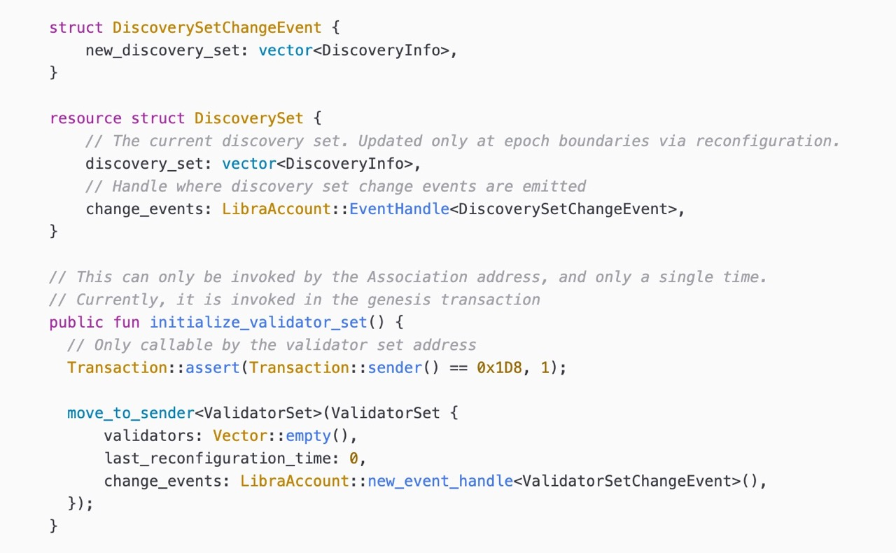

# Move Language syntax for VSCode

This VSCode extension adds Move syntax support to VSCode (see [VSCode marketplace page](https://marketplace.visualstudio.com/items?itemName=damirka.move-syntax)).
Originally started at dfinance, for previous code see [dfinance (pontem) repo](https://github.com/dfinance/vscode-move-ide).

If you want to know more about the language, see these resources:

- [The Move Book](https://move-book.com)
- [Diem Developers Website](https://developers.diem.com/docs/move/move-introduction/)

## Move IDE legacy

From-the-scratch, new version of Move IDE is in development.
Previous versions of Move IDE are still available in VSCode marketplace, new one is not yet ready.

This extension was also created to separate syntax changes from IDE features and let other extension developers use same unified syntax without needing to install Move IDE.

## Highlighting examples

## Contribution

Feel free to ask any questions or report bugs [by opening new issue](https://github.com/damirka/vscode-move-syntax/issues).

## License

Originally licensed under Apache license (see [COPYING](COPYING)). 
Sublicensed as [MIT](LICENSE).